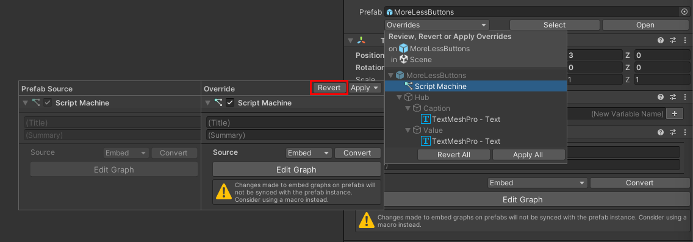

# Visual Scripting troubleshooting

**Issue**: Prefabs that have a *Script Machine* component with its **Source** property set to *Embed*, as opposed to *Graph* (such "graph assets" are also called *Macros* in *Unity.VisualScripting*) often fail to correctly update in instances of the Prefab after they've been edited in the Prefab definition. This issue is common enough for the *Unity.VisualScripting* authors to supply an in-Editor warning:

.

**Solution**: 

If you open a Prefab definition, then edit the embedded visual script, and then look at any instances of that Prefab in your scene and find that they haven't updated properly, do the following:

1. Select the Prefab instance.
1. In the **Inspector**, click the **Overrides** drop-down.
1. Select the "Script Machine" entry (or entries).
1. Click Script Machine's **Revert** button.

.

This reverts the visual script's definition to what it currently is in the prefab's definition--in other words, the updated version of the visual script.
